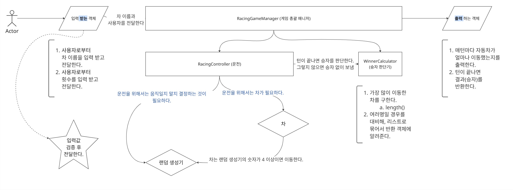

# java-racingcar-precourse
## 우아한 테크코스 프리코스 8기 2주차 미션: 자동차 경주

---

## 0. 객체 협력 흐름

## 1. 주요 기능 목록 (객체 별로 분리)
### 입력
- 역할 : 사용자로부터 입력을 받기 위한 객체
- [ ] 입력 받은 차 이름과 횟수를 **검증 후** 전달한다.

### 게임 총괄 매니저
- 역할 : 경주 게임의 전반적인 **컨트롤**을 위한 매니저
- [ ] 입력으로 들어온 차, 횟수를 **운전 객체**에 전달한다.
- [ ] 횟수에 따라 승자 판단기를 돌려서 결과를 출력 객체에 전달한다.

### 운전
- 역할 : 차와 랜덤 생성기 간의 **메세지 전달**을 맡음. 또한 턴이 끝나면 결과를 **총괄 매니저**에게 전달
- [ ] 차를 운전시킬지 말지를 결정한다. (차의 position 값 증가)
- [ ] 턴이 끝나면, 게임 총괄 매니저에게 턴이 끝났다는 것을 알린다.

### 차
- 역할 : 입력으로 차 이름을 받아서 객체를 생성
- [ ] 차는 움직인 위치(position)와, 이름을 가진다.
- [ ] 차는 랜덤 생성기에서 4 이상의 값이 나오면 움직인다.

### 랜덤 생성기
- 역할 : 차가 움직일지 말지를 결정하는 랜덤 생성기
- [ ] 랜덤 생성기는 랜덤한 번호를 생성해서 차에게 전달한다.
- [ ] 랜덤 생성기는 0에서 9까지의 값 중 무작위 값을 생성한다.

### 승자 판단기
- 역할 : 가장 많이 이동한 차를 구함
- [ ] Winner는 List 컬렉션에 담아서 output 출력기에 전달한다.
- [ ] 승자 판단기는, 턴이 끝나면 게임 총괄 매니저가 호출한다.

### 출력
- 역할 : 결과를 사용자에게 보여주기 위한 객체
- [ ] 게임 총괄 매니저에게 받은 결과를 출력 양식에 맞게 출력한다.